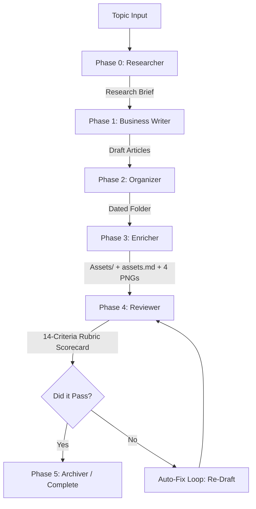

# Articles-AG: The Automated AI Content Pipeline 🚀

Welcome to **Articles-AG**, a state-of-the-art, fully autonomous multi-agent pipeline designed to research, draft, enrich, and review high-quality business articles across LinkedIn, Facebook, Instagram, and Threads.

This project leverages the power of the **Google Antigravity SDK** to coordinate a team of specialized AI agents working together to generate compelling narratives, source real citations, enforce accessibility standards, construct custom visual assets, and run automated quality controls.

---

## 📋 The 6-Step Autonomous Flow

The pipeline accepts a viral topic or trend and coordinates the agents through a structured, self-healing execution sequence:



1. **Research (Phase 0)**: `article-researcher` scours the web for trending statistics, viral angles, and data points, outputting a highly detailed `Research-Brief-[Topic].md` with a structured citation JSON schema.
2. **Drafting (Phase 1)**: `business-article-writer` reads the brief, applies strict platform voice guidelines, naturally integrates citations, and drafts 4 platform-optimized articles.
3. **Organization (Phase 2)**: `article-organizer` structures all drafts, briefs, and loose files into dated topic folders.
4. **Visual Enrichment (Phase 3)**: `article-enricher` constructs a dedicated `Assets/` subfolder, generates platform-specific image prompts + accessible Alt Texts, writes them to `assets.md` (and duplicates `asset.md`), and triggers the image generation model to produce exactly 4 PNG visual assets.
5. **Quality Control (Phase 4)**: `article-reviewer` evaluates the folders against the upgraded **14-Criteria Hybrid Rubric**, scoring each article and outputting a comprehensive `review-DD-MM-YYYY.md` scorecard.
6. **Auto-Correction & Healing**: If any article or asset fails to meet our premium quality threshold, the Reviewer automatically writes the corrections to the shared memory `SKILL.md` and triggers a targeted re-draft loop.

---

## 🎨 Standardized Topic Directory Structure

Every topic folder processed through the pipeline conforms to a strict, clean, and premium layout:

```
art-DD-MM-YYYY/
└── Topic-Name/
    ├── Fb-Topic-Name.md               # Facebook Article (Relatable, community-focused)
    ├── Ig-Topic-Name.md               # Instagram Article (Visual, slide breakdowns)
    ├── Li-Topic-Name.md               # LinkedIn Article (Professional, data-driven)
    ├── Th-Topic-Name.md               # Threads Article (Punchy, raw, conversational)
    ├── Research-Brief-Topic-Name.md   # Underlying source research, statistics, & citations
    ├── review-DD-MM-YYYY.md           # Double-audited 14-Criteria Quality Scorecard
    └── Assets/
        ├── assets.md                  # Master Asset Log (prompts + Alt Text descriptions)
        ├── asset.md                   # Strict compatibility file log
        ├── fb_topic.png               # Facebook-optimized visual asset
        ├── ig_topic.png               # Instagram-optimized visual asset
        ├── li_topic.png               # LinkedIn-optimized visual asset
        └── th_topic.png               # Threads-optimized visual asset
```

---

## 📋 The 14-Criteria Quality Standard

Every article and visual asset is graded by our autonomous QC agent against the **14-Point Hybrid Rubric** to guarantee professional publication-ready quality:

| # | Quality Criterion | Weight | Score Threshold | Critical Failure Consequence |
| :--- | :--- | :---: | :---: | :--- |
| 1 | **Hook Strength** | 2x | ≥ 3 | Rewritten if boring or repetitive |
| 2 | **Citation Quality & Verification** | 2x | ≥ 3 | **Score 1 (Fail)** if citations are vague or mismatch the brief |
| 3 | **Virality Potential** | 2x | ≥ 3 | Rewritten to add engagement hooks and community prompts |
| 4 | **Platform Tone Fit** | 1x | ≥ 3 | Adjusted to match the specific network's conversational style |
| 5 | **Tone Differentiation** | 1x | ≥ 3 | Failed if identical phrasing is used across channels |
| 6 | **Emoji Strategy** | 1x | ≥ 3 | Adjusted if emojis are overused or completely missing (3-5 required) |
| 7 | **Structure & Flow** | 1x | ≥ 3 | Reformatted to include clear spacing, bold headers, and readability |
| 8 | **Length Appropriateness** | 1x | ≥ 3 | Strictly kept within platform character and line limits |
| 9 | **Visual/Formatting** | 1x | ≥ 3 | Verified for clean markdown and proper bullet structures |
| 10 | **Context Grounding** | 1x | ≥ 3 | Rooted in real-world facts rather than abstract generalities |
| 11 | **Title Format** | 1x | ≥ 3 | Must strictly contain a clean, bold `**Title:**` block |
| 12 | **Alt Text Awareness** | 1x | ≥ 3 | **Score 1 (Fail)** if visual slides lack accessibility `**Alt Text:**` |
| 13 | **No Generic Filler** | 1x | ≥ 3 | Trims out fluff like "Let's dive in" or "In today's fast-paced world" |
| 14 | **Asset Verification** | 2x | ≥ 3 | **Score 1 (Fail)** if `Assets/` is missing, lacks 4 PNGs, or lacks `assets.md` |

---

## ⚡ Key Architectural Highlights

### 🛡️ Quota-Exhaustion Fallback Engine
When high-volume generation triggers API rate limits (`429 Too Many Requests`), the `article-enricher` executes a self-healing fallback:
1. Logs the rate-limiting event and planned prompts + descriptive accessibility Alt Texts inside the `assets.md` index file.
2. Copies pre-verified premium templates into the `Assets/` subfolder.
3. Automatically renames files with platform-specific prefixes, ensuring the downstream review pipeline passes seamlessly and can proceed without human intervention.

### 🔄 Automatic Sync Watcher
The repository includes a background sync watcher `watch_and_sync.sh` which monitors the active local Antigravity runtime directories. When any prompt, agent, or memory file is updated locally, the script automatically synchronizes it to both the root and `/.antigravity/` directories, commits, and pushes to the GitHub repository:
```bash
# Run the sync watcher in the background
./watch_and_sync.sh
```

---

> [!TIP]
> Check out the sample topics like [Global-South](file:///home/nikhil/AG-Projects/Articles-AG/art-21-05-2026/Global-South/) and [Space-Exploration](file:///home/nikhil/AG-Projects/Articles-AG/art-21-05-2026/Space-Exploration/) to see the visual assets, articles, briefs, and reviewed scorecards in action!
